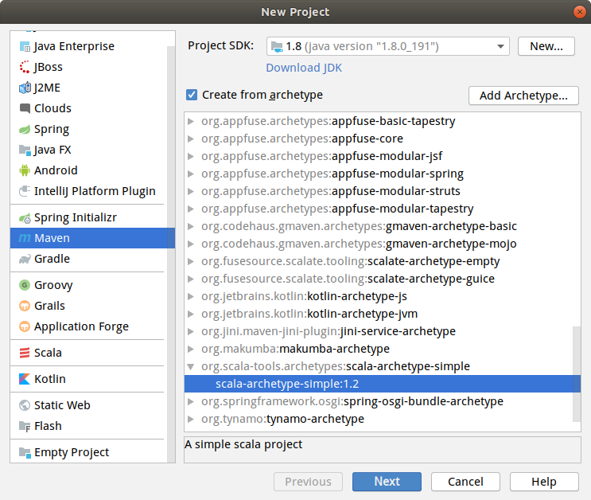
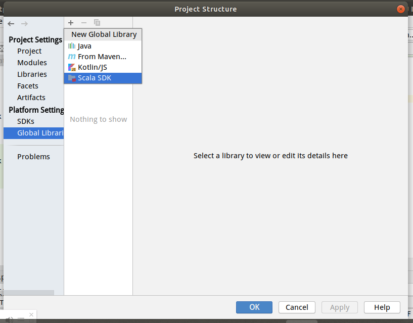
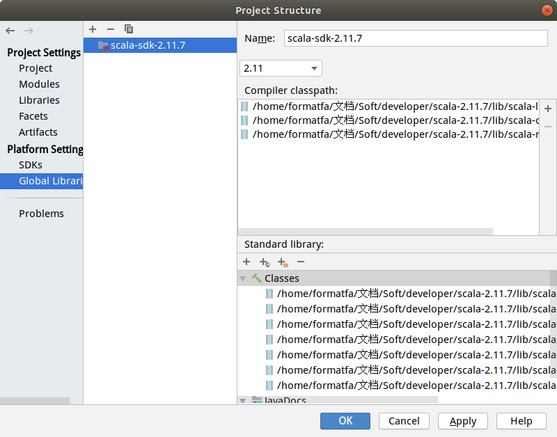
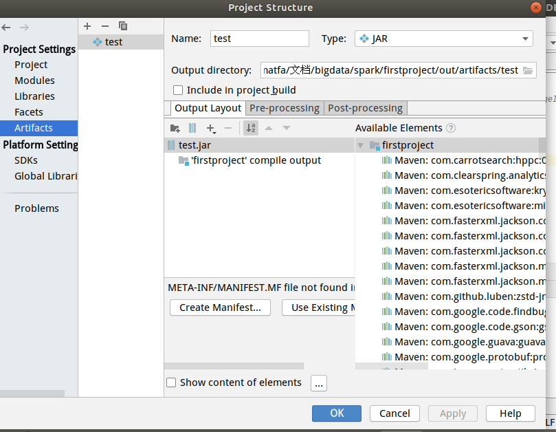
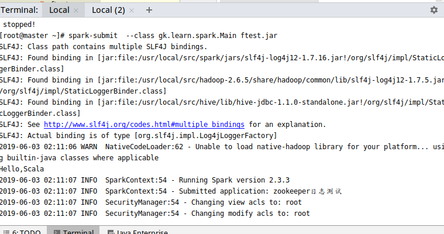
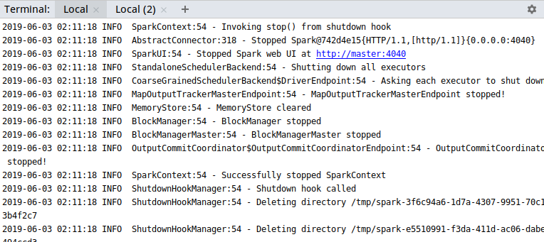

# 创建Spark工程

IDEA里创建Spark Scala 工程 和 简单测试


## 1. 创建Maven Scala 工程

选择Create from archetype

选择org.scala-tools.archetype下的 
**scala-archetype-simple:1.2** 
 



## 2. 设置Scala SDK 
需要先下载解压Scala SDK, 打开工程的Project Structure界面(*选中工程主目录,按F4*)
在Global Libraries里选择添加Scala SDK




## 3. 修改pom.xml,设置Scala版本 

找到  
```xml
<properties>
       <scala.version>xxx</scala.version>
     </properties>
```
修改里面的默认版本为自己的Scala SDK版本
如
```xml
<properties>
       <scala.version>2.11.7</scala.version>
     </properties>
```

## 4. 添加Spark依赖库支持
2.11为对应的Scala版本(可以在仓库里搜索)
```xml
<!--Spark RDD这些的依赖-->
    <dependency>
      <groupId>org.apache.spark</groupId>
      <artifactId>spark-core_2.11</artifactId>
      <version>2.3.0</version>
    </dependency>


<!--  Spark SQL的依赖-->
    <dependency>
      <groupId>org.apache.spark</groupId>
      <artifactId>spark-sql_2.11</artifactId>
      <version>2.4.0</version>
    </dependency>
```
## 5.删除没有的文件

使用archetype创建的工程里的默认Scala版本是2.8.0, 这里使用的是2.11版本的Scala,有一些是不支持的
   1. src/test文件夹
   这个文件夹里面的代码报错，直接把整个test文件夹删除
   2. 默认的App.scala类  
   删除


---

# 测试

测试计算zookeeper启动日志文件 (zookeeper.out)文件里各种日志等级的数量

## 1. 上传文件到HDFS中
```[root@slave1 ~]# hdfs dfs -mkdir /sparktest
    [root@slave1 ~]# ll
    总用量 52
    -rw-------. 1 root root  1261 5月  12 01:04 anaconda-ks.cfg
    -rw-r--r--. 1 root root   408 5月  12 20:06 master_pub_key
    -rwxr-xr-x. 1 root root 25892 5月  12 03:53 mysql80-community-release-el7-2.noarch.rpm
    -rw-r--r--. 1 root root 14395 6月   2 11:16 zookeeper.out
    [root@slave1 ~]# hdfs dfs -put zookeeper.out /sparktest/
    [root@slave1 ~]# 
 
```

## 2. 编写城市

新建Main 的Scala 类(代码先在Spark-shell里测试)
```scala
package gk.learn.spark

import org.apache.spark.{SparkConf, SparkContext}
class Main {

}
object Main
{


  val levels=Set("INFO","WARN")
//  zookeeper启动日志日期统计
    def main(args:Array[String]):Unit={

      println("Hello,Scala")

      val conf = new SparkConf().setAppName("zookeeper日志测试").setMaster("spark://master:7077")
      val sc = new SparkContext(conf)

      var zoo = sc.textFile("/sparktest/zookeeper.out")
//      scala> zoo
      //res2: org.apache.spark.rdd.RDD[String] = /sparktest/* MapPartitionsRDD[1] at textFile at <console>:24

//      统计各个等级日志的行数,INFO,WARN

      print("过滤前的行数:"+zoo.count())

      val result = zoo.map(x=>{

// 2019-06-02 11:12:42,890 [myid:2] - INFO  [main:DatadirCleanupManager@79] - autopurge.purgeInterval set to 0
          val fields = x.split(" ")
          if(fields.length>=5 &&  levels.contains(fields(4)))(fields(4),1)
          else
            ("未知",1)
        }).reduceByKey(_+_)
      result.saveAsTextFile("/sparktest_out")
//
    }

}
```

## 3. 打包成jar 包

F4 打开Project Structure 界面，选择Artifacts,新建一个jar包，将工程的compile output添加进去




Build -> Build Artifacts 
jar输出到 out/artifacts/ftest/ftest.jar

## 4. scp到集群测试

```
scp  out/artifacts/ftest/ftest.jar root@master:/root
```
在集群上运行

```
spark-submit  --class gk.learn.spark.Main ftest.jar
```





最后结果

```
[root@master ~]# hdfs dfs -cat /sparktest_out/*
(INFO,78)
(WARN,3)
(未知,12)
[root@master ~]# 

```


